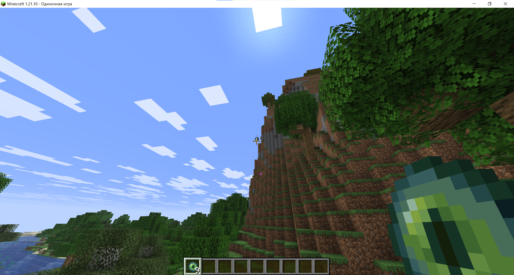
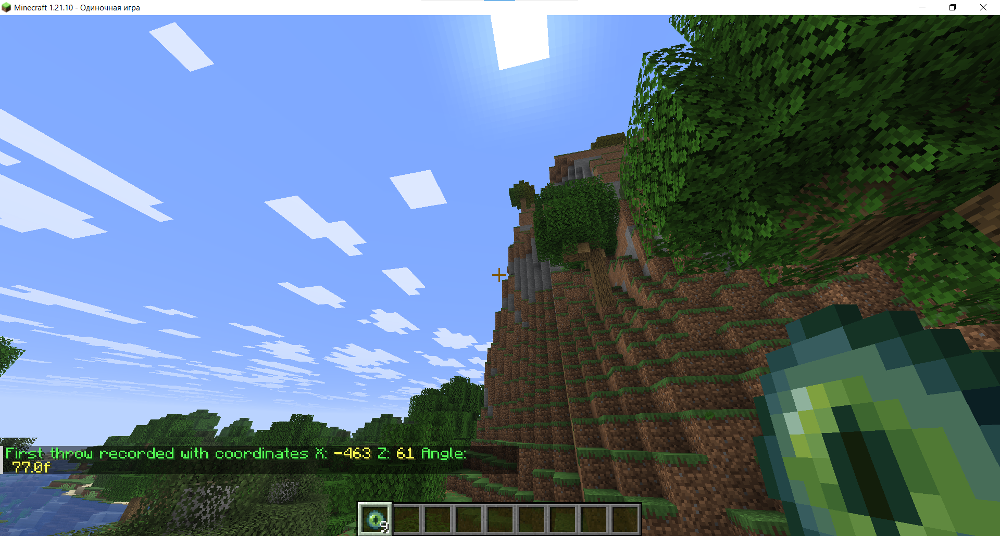
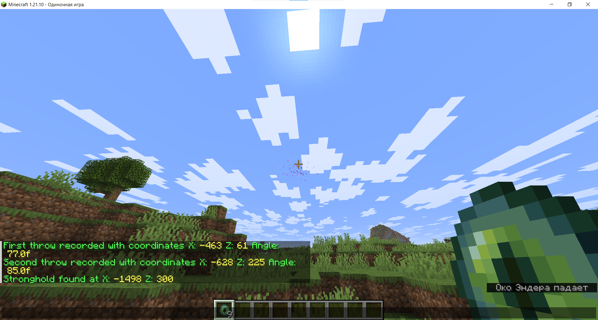

# End Portal Calculator Datapack

Find the exact Stronghold End Portal location using only two Eye of Ender throws — powered by real trigonometry!
And you thought you'd never need this outside of school… 😁

This datapack calculates the precise coordinates of the End Portal by analyzing the trajectory of two Eye of Ender throws, using angle-based triangulation. No guessing, no wasted time, no digging random tunnels — 100% accurate results.

## 📋 How to Use

### 1️⃣ Throw an Eye of Ender and look directly at its center while it's flying and doesn't move mouse



### 2️⃣ Run the command:

```mcfunction
/trigger epc.throw
```



### 3️⃣ Move at least 200 blocks away from your first throw location.

### 4️⃣ Repeat steps 1–2 one more time.

### 5️⃣ Your End Portal coordinates will appear in chat 🎉

